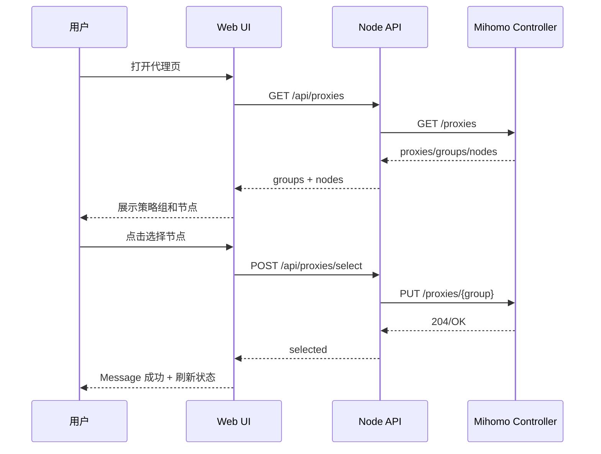

# Mihomo Manager 优化整改设计

## 1. 功能设计

### P0：代理策略组可视化

目标：用户在“代理”页直接看到策略组、当前节点、节点类型和延迟状态，并能明确执行“测速”或“选择”。

交互流程：

1. 用户进入“代理”页。
2. 前端请求 `GET /api/proxies`，兼容别名 `GET /api/groups`。
3. 后端通过 Mihomo controller 读取 `/proxies`，归一化为 `groups + nodes`。
4. 前端左侧展示策略组，右侧展示当前策略组内节点。
5. 当前节点高亮，节点卡片展示延迟颜色。
6. 点击“选择”后调用 `POST /api/proxies/select`，成功后刷新策略组。

时序图：



### P0：节点延迟测速

目标：支持单节点测速和当前策略组逐条测速。全组测速时“测一条出一条”，不等待全部完成。

延迟颜色：

- 绿色：`< 50ms`
- 黄色：`50ms - 199ms`
- 红色：`>= 200ms` 或超时

流程：

1. 单节点测速：点击节点卡片“测速”，调用 `POST /api/proxies/delays`，body 为单个节点。
2. 全组测速：点击“测试延迟”，前端按顺序逐个节点调用同一接口。
3. 每个节点返回后立即更新卡片状态。

### P0：全局反馈和错误处理

目标：所有关键操作有顶部 Message、按钮 Loading、防重复点击和错误详情。

处理策略：

- 成功：顶部绿色轻提示，自动关闭。
- 失败：顶部红色轻提示，显示中文友好原因，并提供“查看详情”折叠面板。
- Loading：触发操作的按钮显示旋转动画，全局操作期间禁用输入控件。
- 友好错误映射：
  - `address already in use` → 端口已占用。
  - `yaml/unmarshal` → 配置文件 YAML 格式错误。
  - `Permission denied/publickey` → SSH 认证失败。
  - `127.0.0.1:9090/connection refused` → Mihomo controller 不可用。

## 2. UI 原型

### 仪表盘

```text
┌────────────────────────────────────────────────────────────┐
│ Local Web Console                         [刷新状态] 已连接 │
├─────────────┬─────────────┬─────────────┬─────────────────┤
│ 服务状态     │ 订阅定时器   │ 系统代理     │ Proxychains      │
│ active      │ enabled     │ 已启用       │ 已配置            │
├────────────────────────────────────────────────────────────┤
│ 状态总览                                                   │
│ ┌──────────────┬─────────────────────────────────────────┐ │
│ │ Mihomo 服务   │ active                                  │ │
│ │ 订阅名称      │ 默认订阅                                │ │
│ │ 订阅链接      │ https://...token=***                    │ │
│ │ 监听端口      │ 127.0.0.1:7890 / 7891 / 9090            │ │
│ └──────────────┴─────────────────────────────────────────┘ │
└────────────────────────────────────────────────────────────┘
```

### 代理策略组

```text
┌────────────── 策略组 ──────────────┬──────────── 当前组节点 ────────────┐
│ AI                当前: HK 03       │ HK 01                  38 ms  🟢  │
│ Proxies           当前: JP 02       │ [测速] [选择]                       │
│ GLOBAL            当前: DIRECT      │ JP 02                  126 ms 🟡  │
│ Auto              当前: HK 01       │ [测速] [已选]                       │
│                                   │ US 03                  超时  🔴   │
│                                   │ [测速] [选择]                       │
└───────────────────────────────────┴──────────────────────────────────┘
```

### 规则管理

```text
┌──────────────────── 当前规则 ────────────────────┬──────── 新增规则 ───────┐
│ 类型统计：DOMAIN 320  DOMAIN-SUFFIX 1900          │ 规则类型 [DOMAIN-SUFFIX] │
│ #1 DOMAIN-SUFFIX example.com  Proxies             │ 规则内容 [example.com  ] │
│ #2 IP-CIDR        192.168.0.0/16 DIRECT           │ 代理策略 [Proxies      ] │
│ #3 MATCH          -              Proxy            │ [新增规则]              │
└───────────────────────────────────────────────────┴────────────────────────┘
```

## 3. 技术实现方案

### 当前代码结构

```text
server.js                 Node API + SSH/local 执行桥
public/index.html         单页 Web UI 结构
public/app.js             前端状态、API 调用和交互逻辑
public/styles.css         面板、卡片、Message、Loading 样式
docs/optimization-plan.md 整改设计文档
```

### 核心接口

```text
GET  /api/proxies
GET  /api/groups
POST /api/proxies/select
POST /api/proxies/delays
GET  /api/rules
POST /api/rules
GET  /api/subscription/settings
POST /api/subscription/settings
POST /api/action
```

### 数据结构

代理组响应：

```json
{
  "groups": [
    {
      "name": "Proxies",
      "type": "Selector",
      "now": "HK 01",
      "options": ["HK 01", "JP 02"],
      "optionCount": 2
    }
  ],
  "nodes": {
    "HK 01": {
      "name": "HK 01",
      "type": "Shadowsocks",
      "udp": true,
      "delay": 38
    }
  }
}
```

前端 API Service 当前采用轻量封装：

- `requestJson()`：统一处理 JSON、超时和 HTTP 错误。
- `notifyPayload()`：统一成功/失败 Message。
- `friendlyError()`：将 stderr/stdout 映射为中文提示。

后续 P3 可迁移为 TypeScript 模块：

```text
public/services/api.ts
public/services/ws.ts
public/types/api.ts
```

## 4. 分阶段开发计划

### P0：核心可用性

- 已完成：策略组可视化。
- 已完成：节点手动切换。
- 已完成：单节点测速。
- 已完成：当前组逐条测速。
- 已完成：顶部 Message、按钮 Loading、错误详情。
- 待增强：连接测试按钮和首次配置页。

### P1：仪表盘和规则增强

- 仪表盘增加 CPU、内存、运行时长、代理模式。
- 接入 Mihomo traffic/connections WebSocket。
- 本地统计今日/本月流量。
- 规则支持编辑、删除、启用/禁用、排序。
- 常用规则模板：绕过国内、广告拦截、直连内网。

### P2：安全和首次使用体验

- 登录/连接配置页前置。
- SSH 密码/密钥表单和测试连接。
- 敏感信息 AES-256 加密存储。
- 显示/隐藏订阅链接开关。

### P3：工程化和审计

- API Service 拆分为独立模块。
- TypeScript 类型定义。
- WebSocket Manager：心跳、重连、按页面激活。
- 审计日志：操作人、时间、动作、结果、错误摘要。
- 日志页增加审计日志筛选。

## 5. 测试用例清单

### 代理策略组

- 正常读取策略组，左侧显示组，右侧显示节点。
- 当前选中节点高亮。
- 点击“选择”后策略组当前节点变化。
- controller 不可用时显示中文错误。

### 节点测速

- 单节点测速成功，延迟显示绿色/黄色/红色。
- 单节点测速超时，显示“超时”和红色状态。
- 当前组逐条测速，节点逐个更新而不是批量结束后更新。
- 测速过程中重复点击被禁用。

### 全局反馈

- 成功操作显示顶部绿色 Message。
- 失败操作显示顶部红色 Message。
- 错误详情可展开，展示原始 stderr/stdout。
- 操作中按钮显示 Loading，重复点击被禁用。

### 订阅和规则

- User-Agent 空值保存后使用默认 `User-Agent`。
- 保存订阅设置后不会泄露 token。
- 新增规则空策略返回 400。
- YAML 校验失败时不覆盖现有配置。

### 本地/远端模式

- `MIHOMO_MODE=local` 不要求 SSH host/私钥/密码。
- `MIHOMO_MODE=remote + MIHOMO_AUTH=key` 使用私钥。
- `MIHOMO_MODE=remote + MIHOMO_AUTH=password` 读取密码并使用 `sshpass -e`。
